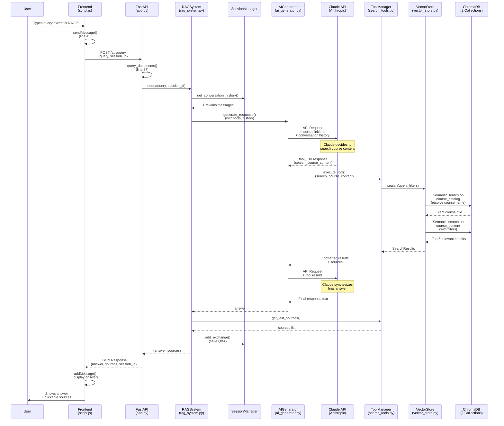

# Query Flow Diagram

## Complete User Query Processing Pipeline

### Mermaid Flowchart



---

## Detailed Component Flow Diagram

```
┌─────────────────────────────────────────────────────────────────────────┐
│                              FRONTEND LAYER                              │
│                           (frontend/script.js)                           │
└─────────────────────────────────────────────────────────────────────────┘
                                    │
                      User types: "What is RAG?"
                                    │
                                    ▼
                    ┌───────────────────────────────┐
                    │   sendMessage() - Line 45     │
                    │   • Get query from input      │
                    │   • Display user message      │
                    └───────────────────────────────┘
                                    │
                                    ▼
                    ┌───────────────────────────────┐
                    │  POST /api/query - Line 63    │
                    │  Body: {                      │
                    │    query: "What is RAG?",     │
                    │    session_id: "session_1"    │
                    │  }                            │
                    └───────────────────────────────┘
                                    │
════════════════════════════════════╪════════════════════════════════════
                                    │
┌─────────────────────────────────────────────────────────────────────────┐
│                             BACKEND API LAYER                            │
│                              (backend/app.py)                            │
└─────────────────────────────────────────────────────────────────────────┘
                                    │
                                    ▼
                    ┌───────────────────────────────┐
                    │ query_documents() - Line 57   │
                    │ • Create session if needed    │
                    │ • Call RAG system             │
                    └───────────────────────────────┘
                                    │
════════════════════════════════════╪════════════════════════════════════
                                    │
┌─────────────────────────────────────────────────────────────────────────┐
│                           RAG ORCHESTRATION LAYER                        │
│                          (backend/rag_system.py)                         │
└─────────────────────────────────────────────────────────────────────────┘
                                    │
                                    ▼
                ┌───────────────────────────────────────────┐
                │        RAGSystem.query() - Line 102       │
                └───────────────────────────────────────────┘
                    │                           │
                    ▼                           ▼
        ┌───────────────────────┐   ┌───────────────────────┐
        │   SessionManager      │   │    Build prompt       │
        │ get_conversation_     │   │  with user query      │
        │    history()          │   └───────────────────────┘
        │                       │               │
        │ Returns last 4 msgs   │               │
        └───────────────────────┘               │
                    │                           │
                    └─────────┬─────────────────┘
                              ▼
════════════════════════════════════════════════════════════════════════
                              │
┌─────────────────────────────────────────────────────────────────────────┐
│                          CLAUDE AI INTEGRATION                           │
│                         (backend/ai_generator.py)                        │
└─────────────────────────────────────────────────────────────────────────┘
                              │
                              ▼
            ┌─────────────────────────────────────────┐
            │  generate_response() - Line 43          │
            │  • Prepare system prompt + history      │
            │  • Add tool definitions                 │
            └─────────────────────────────────────────┘
                              │
                              ▼
            ┌─────────────────────────────────────────┐
            │         PHASE 1: Initial Request        │
            │    client.messages.create() - Line 80   │
            │                                         │
            │    To: Claude API (Anthropic)           │
            │    Model: claude-sonnet-4-20250514     │
            │    System: Prompt + conversation        │
            │    Tools: [search_course_content]       │
            │    tool_choice: "auto"                  │
            └─────────────────────────────────────────┘
                              │
                              ▼
                    ┌─────────────────┐
                    │   Claude API    │
                    │   Processing    │
                    │                 │
                    │  Claude decides │
                    │   to search     │
                    └─────────────────┘
                              │
                              ▼
            ┌─────────────────────────────────────────┐
            │    Response: stop_reason="tool_use"     │
            │    content: [                           │
            │      {                                  │
            │        type: "tool_use",                │
            │        name: "search_course_content",   │
            │        input: {query: "RAG"}            │
            │      }                                  │
            │    ]                                    │
            └─────────────────────────────────────────┘
                              │
                              ▼
            ┌─────────────────────────────────────────┐
            │   _handle_tool_execution() - Line 89    │
            └─────────────────────────────────────────┘
                              │
════════════════════════════════════════════════════════════════════════
                              │
┌─────────────────────────────────────────────────────────────────────────┐
│                          TOOL EXECUTION LAYER                            │
│                        (backend/search_tools.py)                         │
└─────────────────────────────────────────────────────────────────────────┘
                              │
                              ▼
            ┌─────────────────────────────────────────┐
            │   ToolManager.execute_tool() - Line 135 │
            │   • Route to CourseSearchTool           │
            └─────────────────────────────────────────┘
                              │
                              ▼
            ┌─────────────────────────────────────────┐
            │  CourseSearchTool.execute() - Line 52   │
            │  • Call vector store search             │
            └─────────────────────────────────────────┘
                              │
════════════════════════════════════════════════════════════════════════
                              │
┌─────────────────────────────────────────────────────────────────────────┐
│                       VECTOR SEARCH LAYER                                │
│                      (backend/vector_store.py)                           │
└─────────────────────────────────────────────────────────────────────────┘
                              │
                              ▼
            ┌─────────────────────────────────────────┐
            │    VectorStore.search() - Line 61       │
            └─────────────────────────────────────────┘
                    │                       │
                    ▼                       ▼
    ┌───────────────────────┐   ┌───────────────────────┐
    │  STEP 1: Resolve      │   │  STEP 2: Build        │
    │  Course Name          │   │  Filter Dictionary    │
    │                       │   │                       │
    │  _resolve_course_     │   │  _build_filter()      │
    │     name() - Line 102 │   │                       │
    └───────────────────────┘   └───────────────────────┘
                    │                       │
                    ▼                       ▼
    ┌─────────────────────────────────────────────────┐
    │            STEP 3: Query ChromaDB               │
    │         course_content.query() - Line 93        │
    │                                                 │
    │  Parameters:                                    │
    │  • query_texts: ["RAG"]                         │
    │  • n_results: 5                                 │
    │  • where: filter_dict                           │
    └─────────────────────────────────────────────────┘
                              │
                              ▼
════════════════════════════════════════════════════════════════════════
                              │
┌─────────────────────────────────────────────────────────────────────────┐
│                          CHROMADB LAYER                                  │
│                     (Persistent Vector Database)                         │
└─────────────────────────────────────────────────────────────────────────┘
                              │
                              ▼
            ┌─────────────────────────────────────────┐
            │      Semantic Similarity Search         │
            │                                         │
            │  1. Embed query with SentenceTransformer│
            │     (all-MiniLM-L6-v2)                  │
            │                                         │
            │  2. Vector similarity search in         │
            │     course_content collection           │
            │                                         │
            │  3. Apply metadata filters              │
            │     (course_title, lesson_number)       │
            │                                         │
            │  4. Return top 5 chunks with metadata   │
            └─────────────────────────────────────────┘
                              │
                              ▼
            ┌─────────────────────────────────────────┐
            │           Results Returned:             │
            │                                         │
            │  [                                      │
            │    {                                    │
            │      content: "RAG stands for...",      │
            │      metadata: {                        │
            │        course_title: "Course 1",        │
            │        lesson_number: 3                 │
            │      },                                 │
            │      distance: 0.234                    │
            │    },                                   │
            │    ... (4 more chunks)                  │
            │  ]                                      │
            └─────────────────────────────────────────┘
                              │
════════════════════════════════════════════════════════════════════════
                              │
                    RESULTS BUBBLE BACK UP
                              │
                              ▼
        VectorStore → CourseSearchTool → ToolManager
                              │
                              ▼
            ┌─────────────────────────────────────────┐
            │    Formatted Tool Result:               │
            │                                         │
            │    "Course: Building Towards Computer   │
            │     Use with Anthropic                  │
            │     Lesson 4: Agent Workflows           │
            │                                         │
            │     RAG stands for Retrieval-Augmented  │
            │     Generation..."                      │
            │                                         │
            │    (+ 4 more chunks formatted)          │
            └─────────────────────────────────────────┘
                              │
════════════════════════════════════════════════════════════════════════
                              │
┌─────────────────────────────────────────────────────────────────────────┐
│                    CLAUDE AI - FINAL RESPONSE                            │
│                      (backend/ai_generator.py)                           │
└─────────────────────────────────────────────────────────────────────────┘
                              │
                              ▼
            ┌─────────────────────────────────────────┐
            │      PHASE 2: Final Request             │
            │   client.messages.create() - Line 131   │
            │                                         │
            │   Messages:                             │
            │   1. User: "What is RAG?"               │
            │   2. Assistant: [tool_use request]      │
            │   3. User: [tool_results]               │
            │                                         │
            │   Claude synthesizes final answer       │
            │   from retrieved context                │
            └─────────────────────────────────────────┘
                              │
                              ▼
            ┌─────────────────────────────────────────┐
            │         Final Response:                 │
            │                                         │
            │  "RAG (Retrieval-Augmented Generation)  │
            │   is a technique that enhances LLM      │
            │   responses by retrieving relevant      │
            │   information from a knowledge base..." │
            └─────────────────────────────────────────┘
                              │
════════════════════════════════════════════════════════════════════════
                              │
                     RESPONSE BUBBLES BACK
                              │
                              ▼
                    RAGSystem.query()
                              │
                ┌─────────────┴─────────────┐
                ▼                           ▼
    ┌───────────────────────┐   ┌───────────────────────┐
    │  get_last_sources()   │   │  add_exchange()       │
    │  from ToolManager     │   │  Save to session      │
    │                       │   │  history              │
    │  Returns:             │   └───────────────────────┘
    │  ["Course 1:          │
    │   Lesson 4"]          │
    └───────────────────────┘
                │
                ▼
        Return (answer, sources)
                │
════════════════════════════════════════════════════════════════════════
                │
┌─────────────────────────────────────────────────────────────────────────┐
│                           BACKEND API RESPONSE                           │
│                              (backend/app.py)                            │
└─────────────────────────────────────────────────────────────────────────┘
                │
                ▼
    ┌─────────────────────────────────────────┐
    │     JSON Response - Line 68-72          │
    │     {                                   │
    │       "answer": "RAG stands for...",    │
    │       "sources": ["Course 1: Lesson 4"],│
    │       "session_id": "session_1"         │
    │     }                                   │
    └─────────────────────────────────────────┘
                │
════════════════════════════════════════════════════════════════════════
                │
┌─────────────────────────────────────────────────────────────────────────┐
│                         FRONTEND DISPLAY LAYER                           │
│                          (frontend/script.js)                            │
└─────────────────────────────────────────────────────────────────────────┘
                │
                ▼
    ┌─────────────────────────────────────────┐
    │   Receive response - Line 76            │
    │   • Parse JSON                          │
    │   • Update session_id                   │
    │   • Call addMessage()                   │
    └─────────────────────────────────────────┘
                │
                ▼
    ┌─────────────────────────────────────────┐
    │   Display in Chat UI                    │
    │   • Show answer text                    │
    │   • Show clickable source badges        │
    │   • Enable input for next query         │
    └─────────────────────────────────────────┘
                │
                ▼
    ┌─────────────────────────────────────────┐
    │            USER SEES:                   │
    │                                         │
    │  Bot: RAG (Retrieval-Augmented          │
    │       Generation) is a technique...     │
    │                                         │
    │  Sources: [Course 1: Lesson 4]          │
    └─────────────────────────────────────────┘
```

---

## Key Data Transformations

| Stage | Input | Output | Line Reference |
|-------|-------|--------|----------------|
| **Frontend** | User text input | `{query: str, session_id: str}` | script.js:63 |
| **API** | HTTP request | Python objects | app.py:57 |
| **RAG System** | Query + session | Prompt + history | rag_system.py:102 |
| **AI Generator** | Prompt + tools | Tool use request | ai_generator.py:80 |
| **Tool Manager** | Tool name + params | Formatted results | search_tools.py:135 |
| **Vector Store** | Query + filters | SearchResults | vector_store.py:61 |
| **ChromaDB** | Query embedding | Top K chunks | vector_store.py:93 |
| **Back to AI** | Tool results | Final answer text | ai_generator.py:131 |
| **Back to Frontend** | `{answer, sources, session_id}` | HTML display | script.js:85 |

---

## Two Collections in ChromaDB

### course_catalog
- **Purpose**: Fuzzy course name matching
- **Documents**: One per course (4 total)
- **Content**: Course title + metadata
- **Usage**: Resolve "anthropic course" → "Building Towards Computer Use with Anthropic"

### course_content
- **Purpose**: Semantic search over course material
- **Documents**: 800-char chunks (hundreds of documents)
- **Content**: Actual lesson content
- **Metadata**: `{course_title, lesson_number, chunk_index}`
- **Usage**: Find relevant chunks matching query

---

## Performance Notes

- **Latency breakdown:**
  - Frontend → API: ~50ms (local network)
  - RAG orchestration: ~10ms
  - Claude API (Phase 1): ~800ms
  - Vector search: ~100ms
  - Claude API (Phase 2): ~1200ms
  - **Total**: ~2-3 seconds per query

- **Caching opportunities:**
  - Conversation history (in SessionManager)
  - Tool definitions (static)
  - Course catalog lookups (rarely change)

- **Scalability considerations:**
  - Sessions stored in-memory (lost on restart)
  - ChromaDB is local file-based
  - No rate limiting implemented
  - Single-threaded processing
