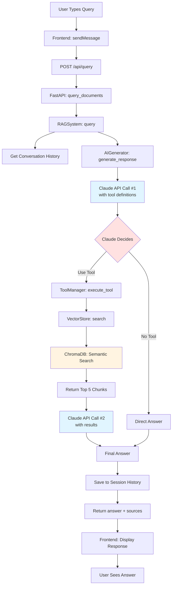

# Simplified Query Flow

## Quick Reference Diagram



---

## 5-Step Overview

```
┌─────────────────────────────────────────────────────────┐
│  STEP 1: FRONTEND                                       │
│  User → sendMessage() → POST /api/query                 │
└─────────────────────────────────────────────────────────┘
                        ↓
┌─────────────────────────────────────────────────────────┐
│  STEP 2: RAG ORCHESTRATION                              │
│  Get history → Prepare prompt → Call AI Generator       │
└─────────────────────────────────────────────────────────┘
                        ↓
┌─────────────────────────────────────────────────────────┐
│  STEP 3: CLAUDE + TOOLS (Two-Phase)                     │
│  Phase 1: Claude decides to search                      │
│  Tool Execution: Vector search in ChromaDB              │
│  Phase 2: Claude generates answer from results          │
└─────────────────────────────────────────────────────────┘
                        ↓
┌─────────────────────────────────────────────────────────┐
│  STEP 4: SAVE & RETURN                                  │
│  Save conversation → Extract sources → Return response  │
└─────────────────────────────────────────────────────────┘
                        ↓
┌─────────────────────────────────────────────────────────┐
│  STEP 5: DISPLAY                                        │
│  Frontend displays answer + clickable sources           │
└─────────────────────────────────────────────────────────┘
```

---

## Component Interaction Summary

| # | Component | Action | Output |
|---|-----------|--------|--------|
| 1 | **Frontend** | Capture query | `{query, session_id}` |
| 2 | **FastAPI** | Route request | Call RAGSystem |
| 3 | **RAGSystem** | Orchestrate | Coordinate components |
| 4 | **SessionManager** | Get context | Previous messages |
| 5 | **AIGenerator** | Call Claude API #1 | Tool use decision |
| 6 | **ToolManager** | Execute search tool | Call VectorStore |
| 7 | **VectorStore** | Semantic search | Top 5 chunks |
| 8 | **AIGenerator** | Call Claude API #2 | Final answer |
| 9 | **RAGSystem** | Finalize | `(answer, sources)` |
| 10 | **Frontend** | Display | Show to user |

---

## Key Files & Line Numbers

```
frontend/script.js:45     ← sendMessage() - User input capture
frontend/script.js:63     ← POST request to /api/query

backend/app.py:57         ← query_documents() endpoint
backend/rag_system.py:102 ← query() - Main orchestration
backend/ai_generator.py:80  ← Claude API call #1 (with tools)
backend/ai_generator.py:89  ← _handle_tool_execution()
backend/search_tools.py:52  ← CourseSearchTool.execute()
backend/vector_store.py:61  ← search() - Semantic search
backend/ai_generator.py:131 ← Claude API call #2 (final answer)
```

---

## Data Flow at Each Stage

```
"What is RAG?"
    ↓
{query: "What is RAG?", session_id: "session_1"}
    ↓
Previous conversation: "User: ...\nAssistant: ..."
    ↓
System prompt + history + tools → Claude API
    ↓
Tool use: {name: "search_course_content", input: {query: "RAG"}}
    ↓
ChromaDB embedding search → Top 5 chunks
    ↓
Formatted results: "Course X, Lesson Y: RAG stands for..."
    ↓
Claude API → "RAG (Retrieval-Augmented Generation) is..."
    ↓
{answer: "...", sources: ["Course 1: Lesson 4"], session_id: "..."}
    ↓
Display in UI with clickable sources
```

---

## The Two-Phase Claude Pattern

This RAG system uses a **two-phase tool execution pattern**:

### Phase 1: Tool Decision
```python
response = claude.messages.create(
    messages=[{"role": "user", "content": query}],
    tools=[search_tool],
    tool_choice={"type": "auto"}
)
# → Claude returns: stop_reason="tool_use"
```

### Phase 2: Final Answer
```python
response = claude.messages.create(
    messages=[
        {"role": "user", "content": query},
        {"role": "assistant", "content": [tool_use_block]},
        {"role": "user", "content": [tool_results]}
    ]
)
# → Claude returns: Final answer text
```

**Why two phases?**
- Claude autonomously decides **if** and **when** to search
- More flexible than hardcoded retrieval
- Claude can answer directly if it already knows

---

## Performance Breakdown

| Stage | Time | Notes |
|-------|------|-------|
| Frontend → API | ~50ms | Local network |
| RAG orchestration | ~10ms | In-memory operations |
| **Claude API #1** | ~800ms | Tool decision |
| Vector search | ~100ms | ChromaDB local |
| **Claude API #2** | ~1200ms | Answer generation |
| Response return | ~50ms | JSON serialization |
| **Total** | **~2-3s** | End-to-end |

---

## ChromaDB Collections

### Two Separate Collections:

**1. course_catalog**
- Purpose: Fuzzy course name matching
- Size: 4 documents (1 per course)
- Used for: "anthropic course" → "Building Towards Computer Use with Anthropic"

**2. course_content**
- Purpose: Semantic search over lessons
- Size: Hundreds of 800-char chunks
- Used for: Finding relevant content matching user query

---

## Quick Debugging Guide

**Query not finding results?**
→ Check `vector_store.py:search()` - verify filters

**Wrong answer from Claude?**
→ Check `search_tools.py:_format_results()` - verify context quality

**Session not persisting?**
→ Check `session_manager.py` - sessions are in-memory only

**Slow responses?**
→ Check `ai_generator.py` - Claude API calls are the bottleneck

**Course name not resolving?**
→ Check `vector_store.py:_resolve_course_name()` - catalog search
